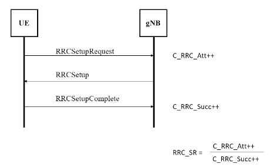
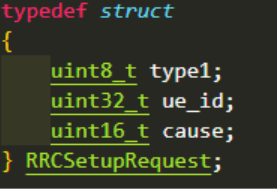
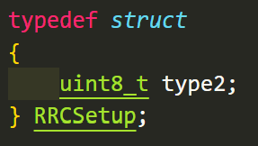
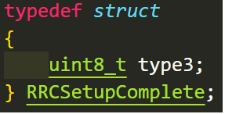

# Bài tập 1: Mô phỏng RRC Connection Establishment
  
Điều kiện:
- 10 UE, mỗi UE gửi 10 RRCSetupRequest/s
- Sau 200s tính ra RRC_SR

### Các structure cho từng msg
1. RRCSetupRequest: 
2. RRCSetup: 
3. RRCSetupComplete: 

### UE và gNB đơn
Dùng giao thức TCP để kết nối:  
soure code:
- header file: bt1.h
- UE: ue_poll.c
- gNB: gNB.c

### UE và gNB multiplexing
Dùng non-blocking IO để gNB xử lý nhiều UE đồng thời. 
Dùng multithreading để tạo nhiều UE chạy song song. 
source code:
- header file: bt1.h
- UE: ue_poll1.c
- gNB: gnb_poll1.c
